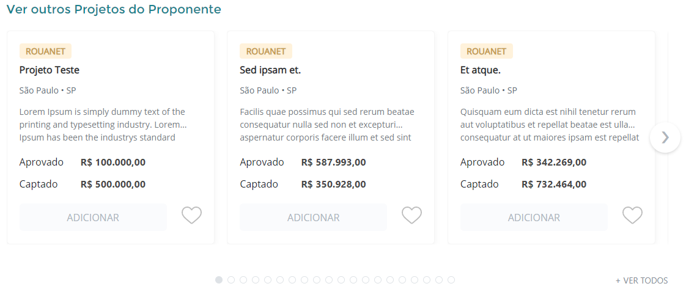
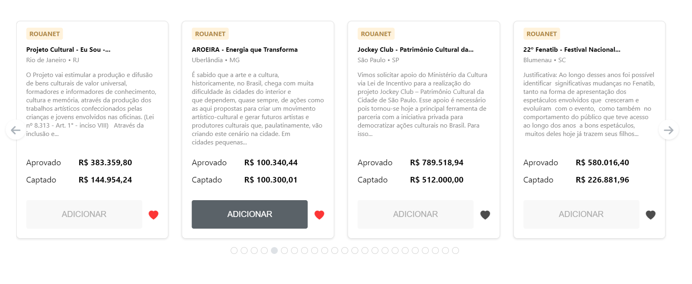
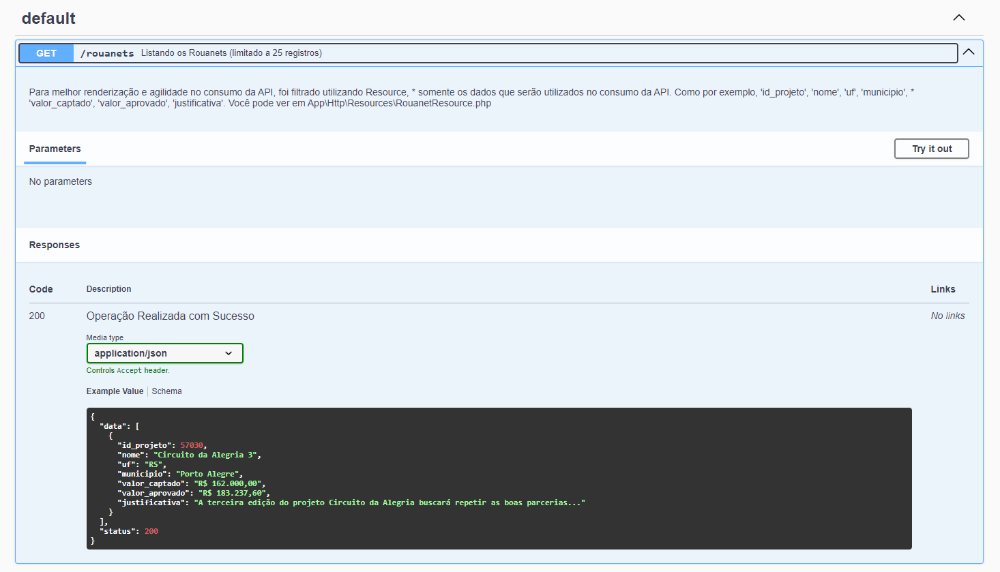

## 
Projeto com Laravel  e React 

### 
Por Jordan Douglas

## Objetivo Case
- Criar uma API com Laravel e documentar utilizando swagger.
- Consumir a API criada utilizando React seguindo o design (imagem) fornecido pela empresa. 

## Resultados Obtidos

### Design fornecido:

### Resultado obtido:

### Documentação API

## Como iniciar o projeto

- Consulte o passo a passo da aplicação <a href="https://github.com/JordanDouglasRDM/simbiose-project/tree/main/backend#readme" target="_blank">backend com laravel</a>.
- Consulte o passo a passo da aplicação <a href="https://github.com/JordanDouglasRDM/simbiose-project/tree/main/frontend#readme" target="_blank">frontend com react</a>.

### 
Dúvidas ou problemas, entre em contato  com o desenvolvedor

 

        
        
		
    
    
      

